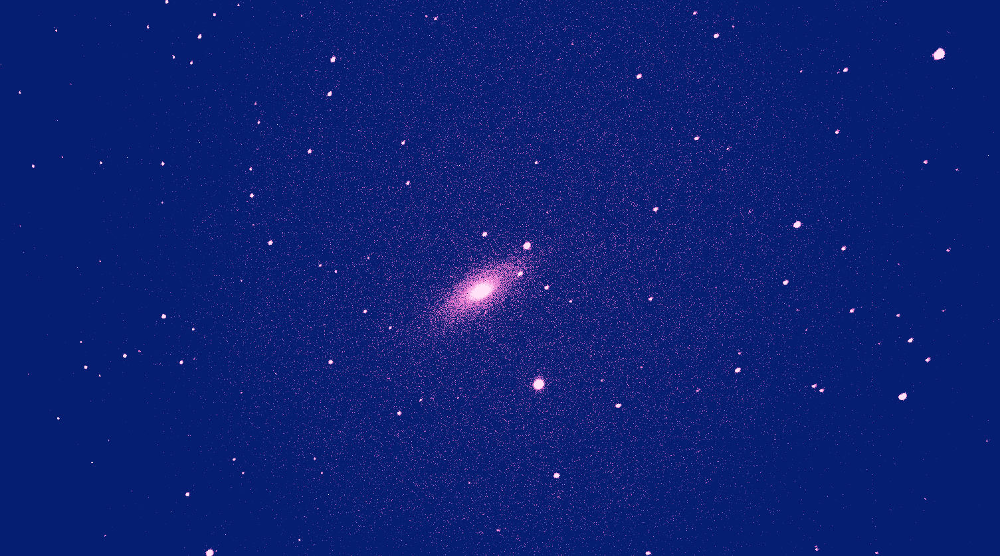

# super-nova-search

Looking for supernovas in the night sky

## Software Components

### Software Environment
- [Anaconda 2 or 3](https://www.continuum.io/downloads)
- [The Sky X with TPoint and Camera Add-Ons](http://www.bisque.com/sc/pages/TheSkyX-Professional-Edition.aspx)

### Telescope and Camera Control

### Image Processing

